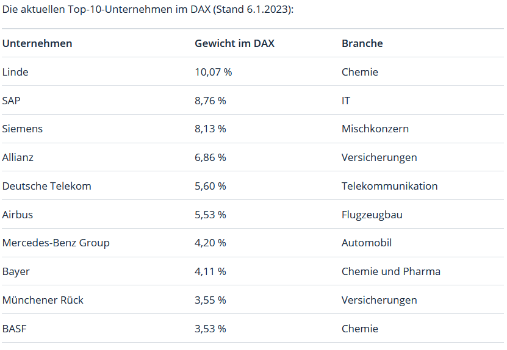

Annahmen:
- Artikel basiert auf der Annahme, dass man aus welchen Gründen auch immer ETFs nutzen will und für sich als sinnvolle Form der Geldanlage sieht
- Eine weitere Annahme ist, dass man Anfänger ist und das Risiko niedrig gehalten werden soll

# Was sind ETFs?
ETFs (Exchange Traded Funds) bilden einen Aktienindex nach. Das kann in Deutschland beispielsweise der DAX oder MDax sein oder in anderen Ländern der Dow Jones (USA) oder S&P500 (USA) oder der Hang Seng Index (China). In diesen Indizes sind meist viele verschiedene Aktien von großen Unternehmen aus verschiedenen Branchen vertreten.

Hier ein Auszug zu den Branchen die im DAX vertreten sind:

Quelle: [https://www.gevestor.de/finanzwissen/aktien/indizes/dax-30-branchen-reprasentieren-die-deutsche-wirtschaft-644984.html](https://www.gevestor.de/finanzwissen/aktien/indizes/dax-30-branchen-reprasentieren-die-deutsche-wirtschaft-644984.html)

Der DAX misst aktuell die Wertentwicklung der 40 größten und (bezogen auf die Streubesitz-Marktkapitalisierung) liquidesten Unternehmen des deutschen Aktienmarktes und repräsentiert rund 80 Prozent der Marktkapitalisierung börsennotierter Aktiengesellschaften in Deutschland.
Quelle: [https://de.wikipedia.org/wiki/DAX](https://de.wikipedia.org/wiki/DAX)

Man könnte sich einen europäischen Index wie den EURO STOXX 50 ansehen oder man geht direkt auf weltweite Indizes wie MSCI World, MSCI Emerging Markets. Auch sehr beliebt sind in der Regel amerikanische Indizes wie der NASDAQ, Dow Jones und S&P 500.

# Auswahl eines ETFs

Wenn man sich grob überlegt hat in welche Richtung es gehen soll, geht es an die Details: 
- Welcher ETF soll konkret gekauft werden?

Es gibt verschiedene "Suchmaschinen" bei denen man sich einen Überblick verschaffen kann und anhand der verfügbaren Kriterien einen ersten Eindruck gewinnen kann, was wichtig sein könnte. Beziehungsweise über welche Dinge man sich noch Gedanken machen muss.

Als Beispiel verwende ich im folgenden diese Seite: [https://www.finanzfluss.de/informer/etf/suche](https://www.finanzfluss.de/informer/etf/suche)

## Assetklasse

Zu Beginn ist es sinnvoll erstmal mit der Assetklasse Aktien zu starten. Jede Assetklasse hat ihre Vor- und Nachteile und für manche Assetklassen ist es sinnvoll, schon Erfahrungen gesammelt zu haben.

Hier stehen zur Auswahl:
- Aktien
- Anleihen
- Geldmarkt
- Immobilien
- Rohstoffe
- Kryptowährungen

## Strategie

Hier kann man verschiedene Strategien auswählen. Entweder ein Regionenfokus wie beispielsweise auf "Welt" oder "Asien" oder beispielsweise ein Fokus auf Sektoren wie "Technologie".

- Region
- Land
- Sektor
- Aktienstrategie
- Thema

## Index

Der Index bildet die Basis für den ETF. Von der Wahl des Index ist sowohl die Rendite als auch das Risiko abhängig.
Hier muss man auswählen zwischen breit gestreuten Indizes wie beispielsweise dem MSCI World  (mit über 1600 Unternehmen aus aller Welt) oder Nischen Indizes wie dem Nasdaq CTA Artificial Intelligence der sich auf KI fokussiert und nur 67 Werte enthält.

Die entspannteste und einfachste Variante ist dabei auf das weitere Wachstum der Weltwirtschaft zu setzen. Dafür bietet sich dann einer der Weltindizes an.
Da gibt es beispielweise den MSCI World der allerdings nur Aktien aus Industrieländern enthält. Der MSCI ACWI enthält dagegen auch Aktien aus Schwellenländern.
Und dann gibt es auch noch andere Indexanbieter wie FTSE. Beispielweise mit dem FTSE All-World der sowohl Industrie- als auch Schwellenländer enthält.

## Sparplan-ETFs

Wenn man einen Sparplan für den ETF Kauf einrichten möchte macht es Sinn zur Kostenreduzierung ETFs auszuwählen die man kostenlos besparen kann.

- kostenlose Sparpläne

## Replikation

Die Replikationsmethode ist an dieser Stelle erstmal nicht allzu relevant. Alle Replikationsmethoden haben ihre Vor- und Nachteile und werden je nach Ziel des ETF eingesetzt. Tendenziell lässt sich sagen, dass physisch replizierende ETFs eher zur Abbildung kleinerer Indizes eingesetzt werden, da die Kosten beim Kauf vieler Wertpapiere stark steigen.
Bei der Sampling Methode wird nur eine repräsentative Teilmenge der im Index enthaltenen Aktien. Dabei fallen meist Wertpapiere mit einer geringen Gewichtung und somit geringem Einfluss auf den Wert raus. Das spart Transaktionskosten.
Bei der synthetischen Replikation werden zwischen dem ETF-Anbieter und einem Partner Tauschgeschäfte (Swaps) abgeschlossen. Dies ist insbesondere bei illiquiden Anlageklassen der Fall.

Es gibt:
- Physisch
- Synthetisch
- Sampling

## Ausschüttung

Thesaurierend
Ausschüttend

## Fondsvolumen

Hier sollte man, wenn es nicht gerade um einen Nischen-ETF geht, mindestens ein Fondsvolumen von 100 Millionen € auswählen.
In dieser Größenordnung muss ein ETF in der Regel sein um für den Anbieter wirtschaftlich tragfähig zu sein [Quelle](https://extraetf.com/de/wissen/etf-schliessung)

Kriterien:
- Über 50 Millionen €
- Über 100 Millionen €
- Über 500 Millionen €
- Über 1 Mrd. €

## Fondsalter

Dieses Kriterium ist ähnlich wie das Fondsvolumen relevant um die Gefahr einer Fondschließung zu minimieren und den damit einhergehenden Aufwand zu vermeiden.
Daher empfiehlt sich ein Mindestalter von 3-5 Jahren als Suchkriterium zu verwenden. Das schließt nach aktuellem Stand (Dezember 2023) auch die letzte Krise am Aktienmarkt (März 2020) mit ein. 

Kriterien:
- Neuemissionen
- Älter als 1 Jahr
- Älter als 3 Jahre
- Älter als 5 Jahre
- Älter als 10 Jahre

Am Ende kann man die Ergebnisse z.B. noch nach der TER (die Kosten des ETF) sortieren und dann nach einem passenden ETF suchen.

Natürlich gibt es noch viele weitere Kriterien nach denen man einen Fonds auswählen kann und sollte. Deswegen sollte das hier eher als Einstieg und für die ersten Gehversuche genutzt werden.

# Quellen
- [https://www.finanzfluss.de/blog](https://www.finanzfluss.de/blog)
- [https://www.finanztip.de/](https://www.finanztip.de/)
- [https://www.gevestor.de/finanzwissen/aktien/indizes/dax-30-branchen-reprasentieren-die-deutsche-wirtschaft-644984.html](https://www.gevestor.de/finanzwissen/aktien/indizes/dax-30-branchen-reprasentieren-die-deutsche-wirtschaft-644984.html)
- [https://extraetf.com/de/wissen/etf-schliessung](https://extraetf.com/de/wissen/etf-schliessung)