The goal is to quickly get up and running with a free personal blog based on markdown.

# Steps
For this tutorial it is assumed, that you already have a github account.
If yes follow the outlined steps. If no, create a new account!

1. Create a new repository
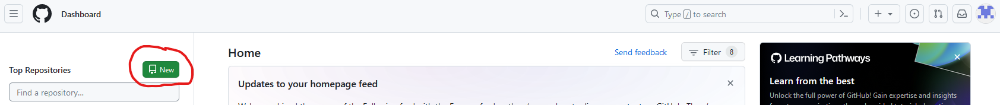

2. Choose a name and set it public. GitHub pages is currently (October 2023) only available for public repositories or for paying users
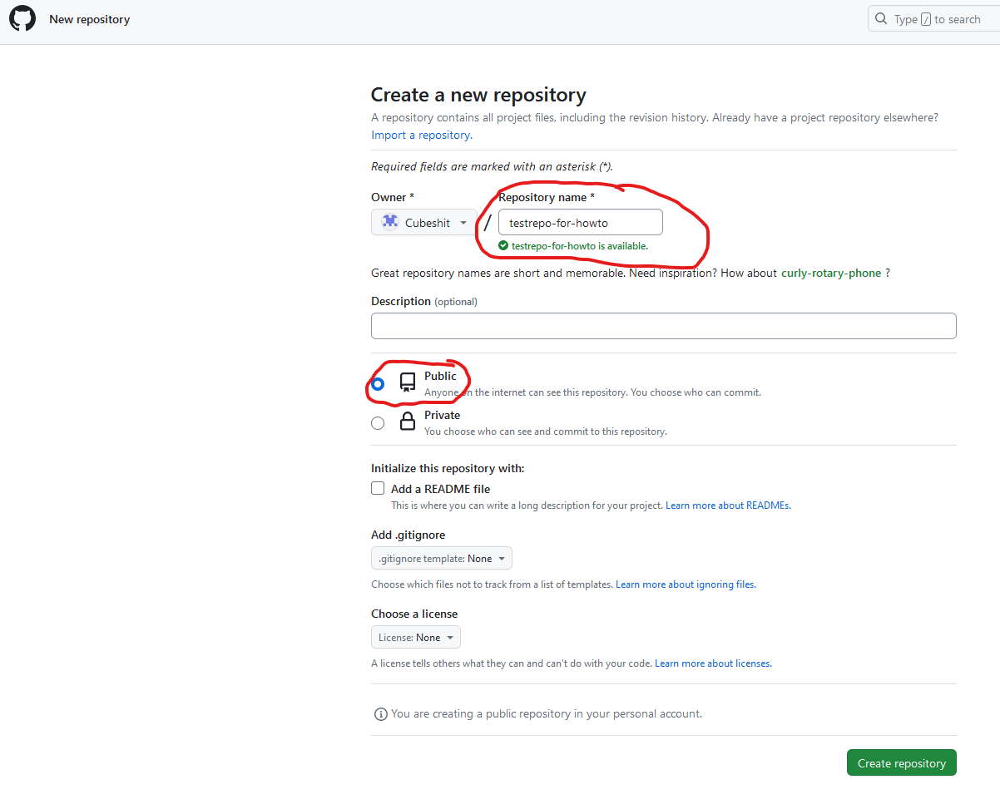

3. Clone the repository to your computer with GitHub Desktop
Assumption: Use of GitHub Desktop - people familiar with the git command line probably don't need this HowTo/Tutorial
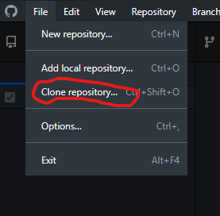

4. Now the files can be changed, and new files can be created with the editor of choice
	1. My recommendation is to make a folder - which can be named as wished - to host all the files for the blog. Its a cleaner setup and makes it easier to change the structure of the blog later on. (Mine is named "docs")
	2. What is needed: A file "README.md"
		1. This is the entry point to your blog
5. If you think you have something publishable you can commit the changes
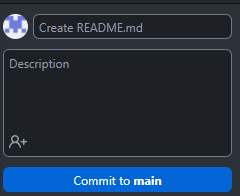

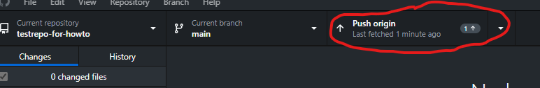

6. Now go to "Settings" and "Pages" to setup Github Pages
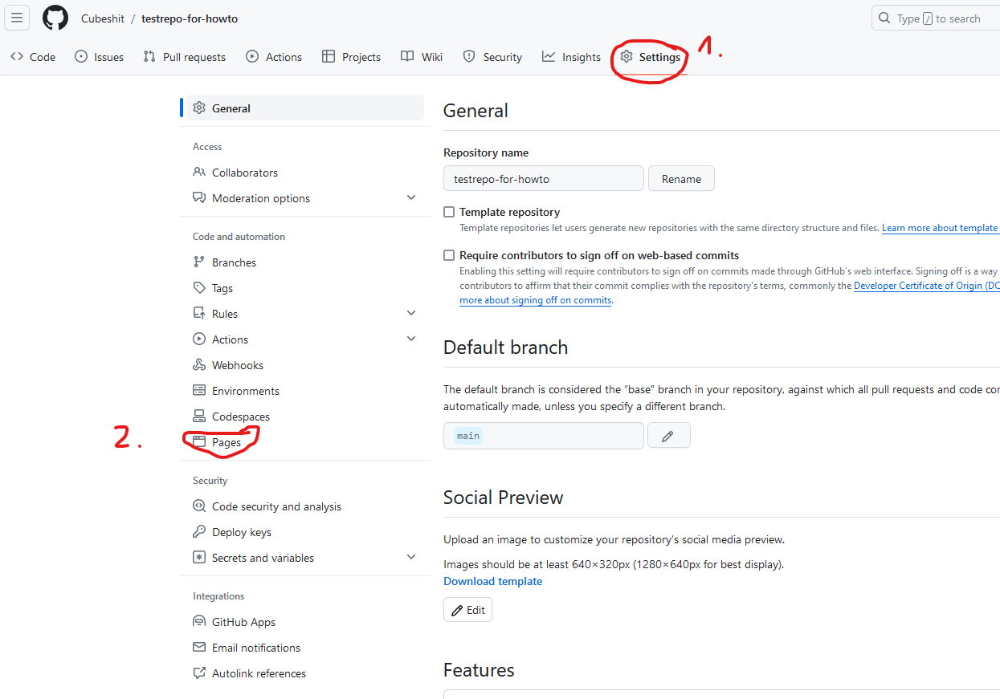

7. Setup Github Pages
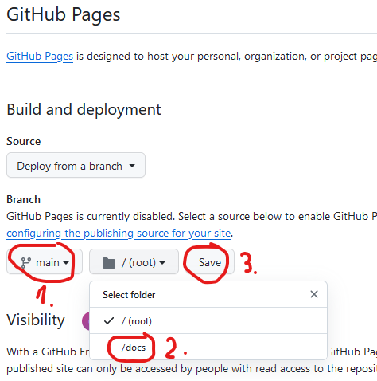

8. Check your first site!
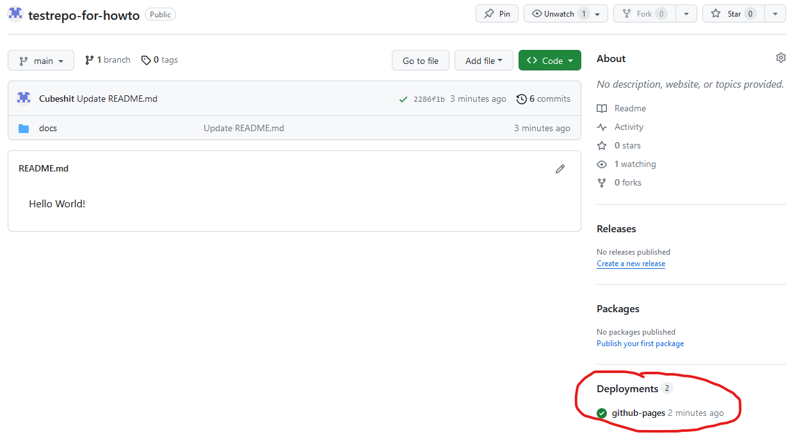

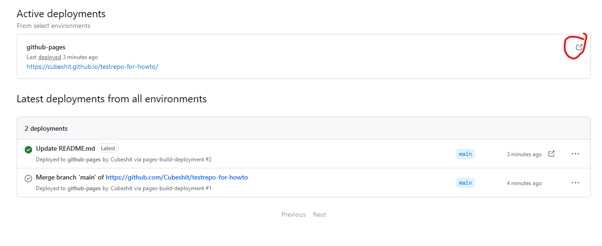

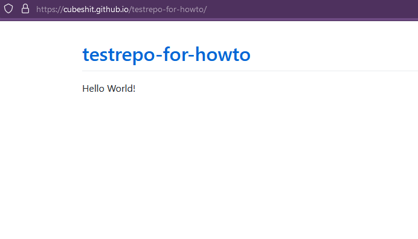

10. Now you can write additional articles and link to them from the README.md
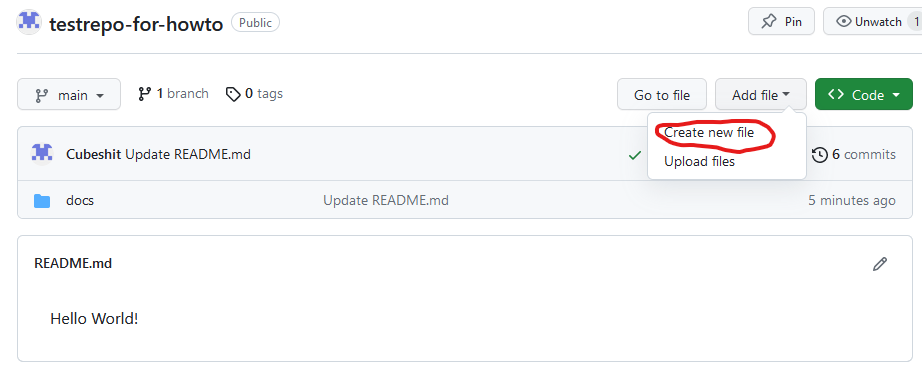

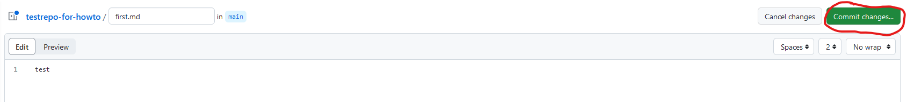

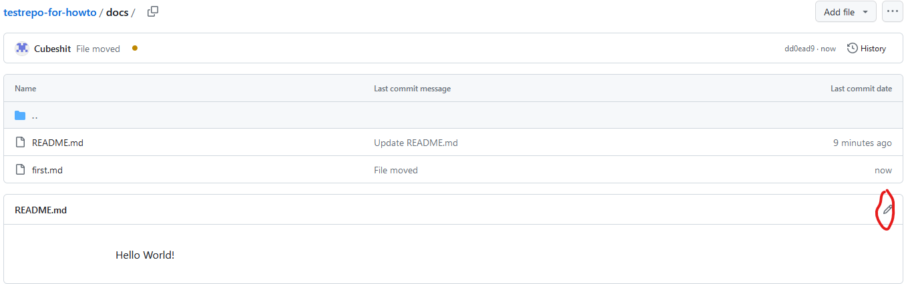

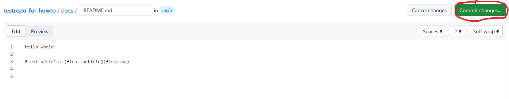

9. That's it. Have fun!
# Trivia
- It can take some time for changes to be published

